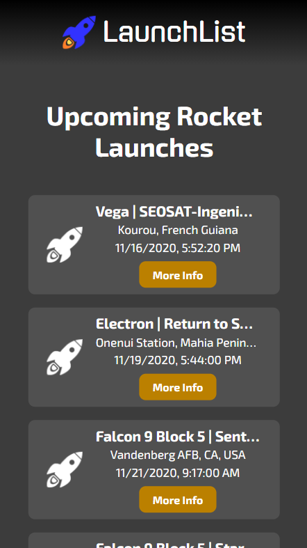
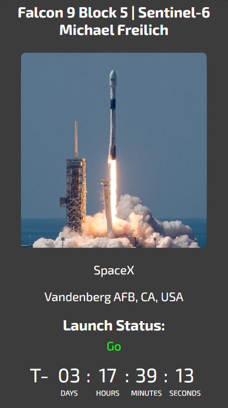
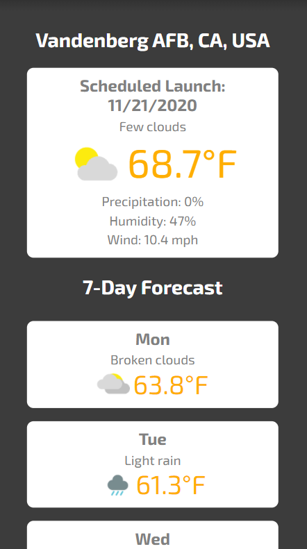

# launchlist

A dynamic HTML, CSS, and JavaScript solo project. Using data from thespacedevs API, LaunchList displays dynamic, up-to-date data for upcoming and past rocket launches worldwide, including launch dates, names, agencies, and launch status as well as an active countdown timer. Weather forecasts for launch locations are also displayed using data from weatherbit API.

