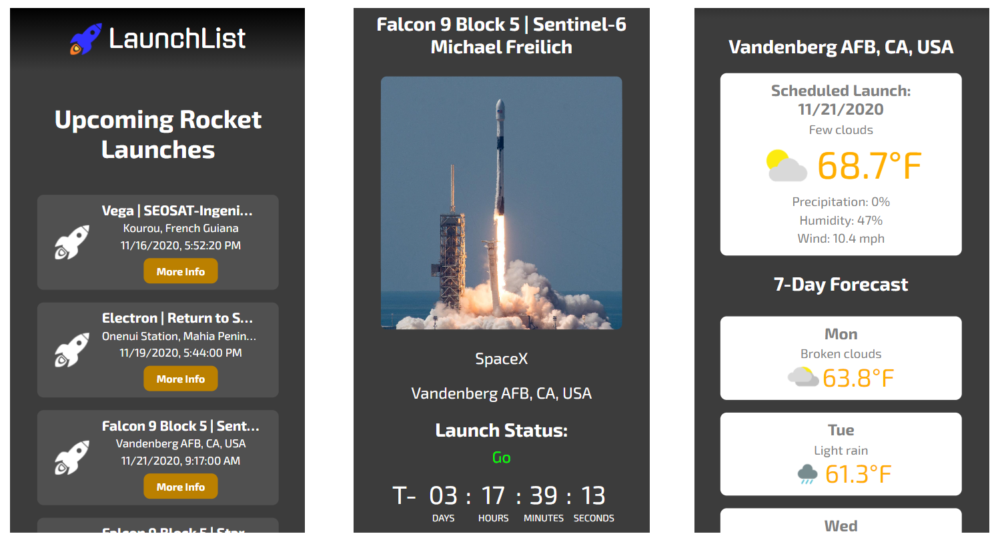

# launchlist

A dynamic HTML, CSS, and JavaScript solo project for tracking space launches using data from thespacedevs API and Weatherbit API

## Live Demo

Try the application live at [https://kelly-hansen.github.io/launchlist](https://kelly-hansen.github.io/launchlist)

## Features

- Users can view lists of 10 upcoming or recent space launches
- Users can view up-to-date launch details including launch date, agency, status, and mission
- Users can view active launch countdown timer
- Users can view launch weather forecast

## Possible Future Additions

- Watch streaming launch video
- Favorite and share launches

## Preview

